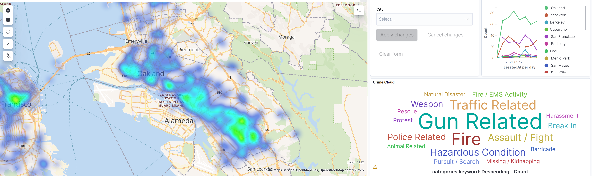

# pleb
Retrieve data from Citizen and deliver to ElasticSearch with geo point data




## Why 

Citizen App provides a great dataset on recent physical security events in your area, however the data is only available for 1 week at a time. This project allows you to aggregate the data for future use, allowing you to analyze trends over larger periods of time.

## How 

Plebeian uses an undocumented Citizen API to retrieve data, and gives you the ability to index that data in ElasticSearch. Additional functionality allows for the conversion of location data into ElasticSearch compatible geo points.

## Usage

### First use - Initialize a new elasticsearch index with a geo point mapping

```
./pleb --first-run --index demo-data

[200 OK] {"acknowledged":true,"shards_acknowledged":true,"index":"demo-data"} <nil>
[200 OK] {"acknowledged":true} <nil>
```
### Subsequent use - Index data into newly created index
```
 ./pleb --index demo-data
```

### Usage options
```
Usage of ./pleb:
  -endpoint string
        ElasticSearch URL (default "http://localhost:9200")
  -first-run
        Initialize the index with a geo point
  -index string
        ElasticSearch index name (default "pleb-app")
  -region string
        pleb region - bayarea, dc, la, nyc, atl (default "bayarea")
  -stdio
        Output to stdio instead of sending data to ElasticSearch
```
